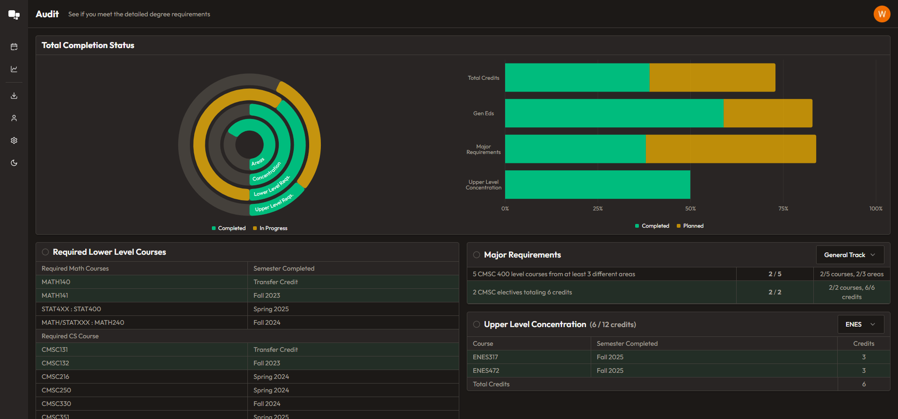
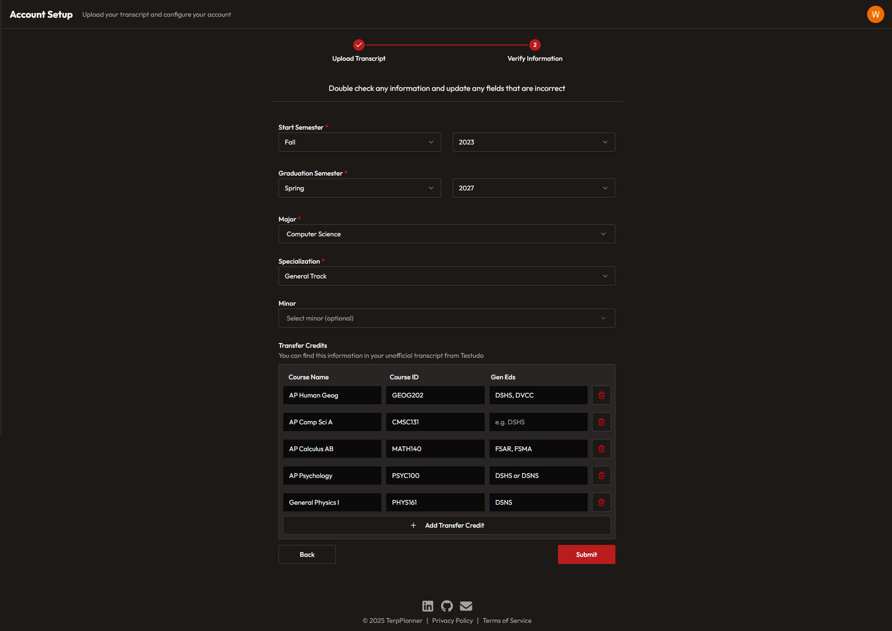
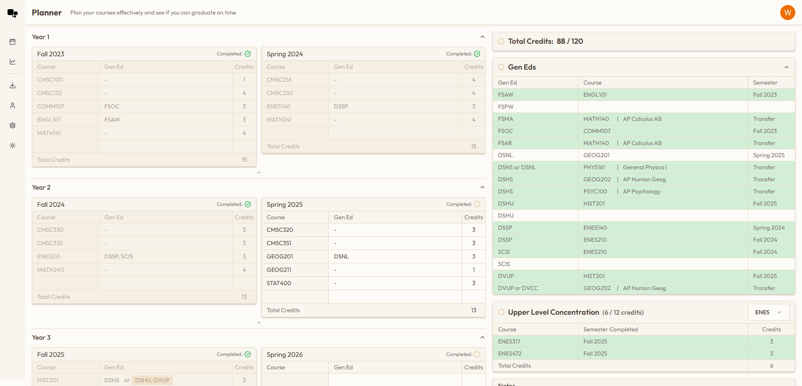
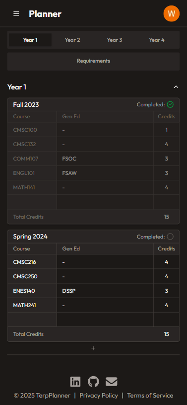

<div align="center">
    
    <h3 align="center">TerpPlanner</h3>

  <p align="center">
    A full-stack web app that helps UMD students create and visualize their four-year academic plans
    <br />
    <a href="https://terpplanner.com"><strong>Terpplanner.com</strong></a>
  </p>
</div>

## ℹ️ About TerpPlanner

TerpPlanner allows UMD students to design semester-by-semester course schedules and visualize their path to graduation.  
Users can add, edit, and organize courses across multiple years while saving their plans for future reference.
<br/>
<br/>
Get stared by uploading your transcript, and download your plan as a PDF to share with your advisor during your mandatory meeting!

[![TerpPlanner Main Screenshot][main-screenshot]](https://terpplanner.com)

## ✨ Features

- Plan and organize courses by semester
- Automatically fetch Gen Eds and credits for each course using the UMD API
- Track progress toward Gen Eds, major requirements, and upper-level concentrations
- Import transcript to auto-fill completed courses
- Export academic plan as a PDF to share with your advisor
- Visualize CS track requirements and area constraints
- Support for winter and summer courses

## 🛠️ Tech Stack

### Frontend

- ![Next.js][Next.js]
- ![React][React.js]
- ![TailWindCSS][TailWind]
- ![TypeScript][TypeScript]

### Backend

- ![Java][Java]
- ![Spring Boot][Spring]
- ![PostgreSQL][Postgres]
- ![Vercel][Vercel]
- [![Azure][Azure]][Azure-url]
- [![GitHub Actions][GitHubActions]][GitHubActions-url]

## ⭐ Why I Built This Project

As a CS student, I found it challenging to manually manage my degree requirements, from tracking Gen Eds, to making sure I satisfied upper-level concentration areas, to fitting in CS track and area constraints. Shuffling courses around semester by semester was time-consuming and error-prone

I built this project to automate that process - pulling official course data from the UMD API, dynamically tracking requirements as you add classes, and giving you an interactive way to explore different scheduling scenarios. It let me combine my interest in backend systems with designing clean, user-friendly interfaces that simplify an otherwise complex planning process

## 📖 What I Learned

- How to design a full-stack application that can **scale to serve real users**
- Deploying on **Azure** with **GitHub Actions CI/CD**, which taught me how to automate builds and deliver updates reliably
- Solving a tough **cold start problem** on the backend by pre-initializing the Spring Boot service when users visited the landing page - a creative optimization that improved user experience
- On the frontend, learning how to manage the **state of complex, interactive components and charts** in Next.js while keeping the UI responsive and intuitive
- On the backend, gaining deep experience with **Spring Boot** - especially handling transformations, business logic, and edge cases required to properly track degree requirements and course rules

## 🎞️ Image Gallery

<div align="center">
    <h3>Major Progress Visualizations</h3>
    
    <h3>Sign-up Screen After Uploading Transcript</h3>
    
    <h3>Dashboard Light Mode</h3>
    
    <h3>Mobile View</h3>
    
</div>

## Running Locally

Run everything from the repo root:

```powershell
docker compose up --build
```

That starts PostgreSQL, the Spring Boot backend, and the frontend with `next dev`, so frontend changes hot reload automatically.

The frontend container reads env vars from `frontend/.env.local`. If you do not have one yet, start from `frontend/.env.example`.

## 📞 Contact

Will Graham | [LinkedIn](https://www.linkedin.com/in/will-graham-4623022a8/) | willgraham367@gmail.com

Project Link: [https://terpplanner.com](.com) | [https://github.com/WillGraham36/four-year-plan-maker](github.com/WillGraham36/four-year-plan-maker)

[Next.js]: https://img.shields.io/badge/next.js-000000?style=for-the-badge&logo=nextdotjs&logoColor=white
[React.js]: https://img.shields.io/badge/React-20232A?style=for-the-badge&logo=react&logoColor=61DAFB
[TailWind]: https://img.shields.io/badge/Tailwind_CSS-38B2AC?style=for-the-badge&logo=tailwind-css&logoColor=white
[TypeScript]: https://img.shields.io/badge/TypeScript-007ACC?style=for-the-badge&logo=typescript&logoColor=white
[Java]: https://img.shields.io/badge/Java-ED8B00?style=for-the-badge&logo=openjdk&logoColor=white
[Spring]: https://img.shields.io/badge/Spring_Boot-6DB33F?style=for-the-badge&logo=springboot&logoColor=white
[Postgres]: https://img.shields.io/badge/PostgreSQL-316192?style=for-the-badge&logo=postgresql&logoColor=white
[Vercel]: https://img.shields.io/badge/Vercel-000000?style=for-the-badge&logo=vercel&logoColor=white
[Azure]: https://img.shields.io/badge/Azure-0089D6?style=for-the-badge&logo=microsoft-azure&logoColor=white
[Azure-url]: https://azure.microsoft.com/
[GitHubActions]: https://img.shields.io/badge/GitHub_Actions-2088FF?style=for-the-badge&logo=github-actions&logoColor=white
[GitHubActions-url]: https://github.com/features/actions
[main-screenshot]: frontend/public/images/dashboard.png
